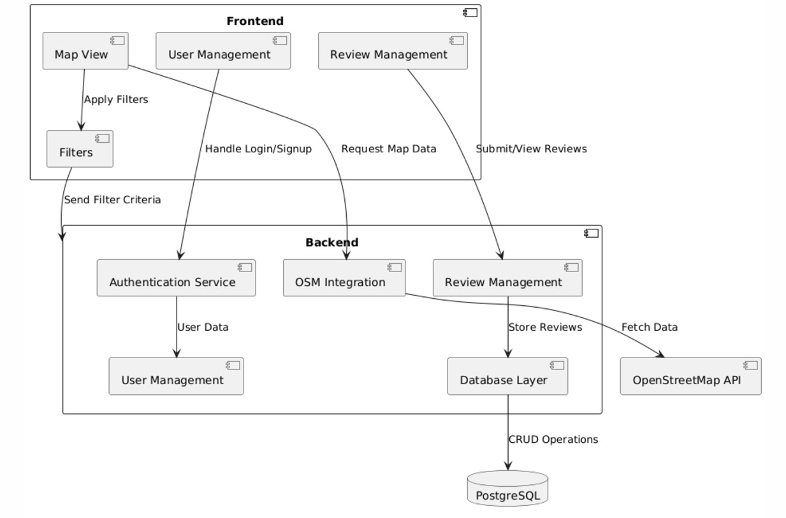

# SAD (**S**oftware **A**rchitecture **D**ocument)

## 1. Introduction

### 1.1 Purpose

This document provides a comprehensive architectural overview of the system, using a number of different architectural views to depict different aspects of the system. It is intended to capture and convey the significant architectural decisions which have been made on the system.

### 1.2 Scope

This Software Architecture Document provides an architectural overview of the Green-Sprout Restaurant Search-and Review System. This Document has been generated under the input of all members participating as part of the Software Engineering project using a Software Architecture Document template.

### 1.3 Definitions, Acronyms and Abbreviations

The following Definitions, Acronyms and Abbreviations are used.:

- API  Application Programming Interface
  
- CRUD  Short for "Create, Read, Update and Delete"
  
- JWT  Jason Web Token

- OSM  Open Street Map

- ORM  Object-Relational Mapping

- UML  Unified Modeling Language

### 1.4 References

Applicable references are:

- All of the material contained in our Github Repositories
  
  - https://github.com/green-sprout/backend
    
  - https://github.com/green-sprout/frontend
    
  - https://github.com/green-sprout/green-sprout
    
  - https://github.com/green-sprout/docs
  
## 2. Architectural Representation

This document presents the architecture as a series of views:
 
- Process View
  
- Implementation View
  

The purpose of these views is to relay the structure and function of the Software in a concise manner using UML-Diagrams whenever possible.

## 3. Architectural Goals and Constraints

The software architecture follows a clear goal of combining user-friendliness and technical requirements. A focus is placed on aesthetics: a uniform, green-colored design system with consistent visual elements and interactive elements improves user-friendliness through direct feedback.

Backwards compatibility ensures the easy provision of new versions to guarantee problem-free updates. The performance of the application is optimized by response times of less than 2 seconds, ideally less than 1 second. A Google Page Speed Score of at least 90 points ensures fast loading times.

The modular architecture separates backend, frontend and database, which increases maintainability and simplifies future extensions. For security reasons, passwords are hashed and only stored as a hash, while JWT tokens ensure the authentication and integrity of user requests.

This architecture ensures a reliable system with a high level of user-friendliness and flexibility.

## 6. Process View

The sequence diagram shows how a user selects filter criteria via the front end, whereupon the backend retrieves the appropriate map information from the Open Street Map API.
The user can select a restaurant whose details and ratings are provided by the backend.
They can also write a review, which is saved in the database via the backend.
## 8. Implementation View
### Komponentendiagramm der Webanwendung

### Component Diagram Overview  

The component diagram illustrates the architecture of the web application and highlights the main software components and their interactions. The application consists of a frontend and a backend layer that communicate with each other, as well as with external APIs and a database.  

### Components and Their Responsibilities  

### Frontend  
The frontend includes the following components:  

#### **Map View**  
- Displays restaurants and map data based on filters selected by the user.  
- Sends requests to the backend and the OSM integration to update map data.  

#### **Filters**  
- Allows users to select search criteria such as cuisine, dietary preferences, or ratings.  
- Sends the selected filter criteria to the backend and directly to the OSM integration to retrieve filtered data.  

#### **User Management**  
- Handles user registration, login, and session management.  
- Communicates with the Authentication Service in the backend.  

#### **Review Management**  
- Enables registered users to write reviews and view existing ones.  
- Submits new or updated reviews to the backend for storage.  

### Backend  
The backend includes the following components:  

#### **Authentication Service**  
- Handles user authentication (login, registration).  
- Sends and verifies user information in the User Management component.  

#### **User Management**  
- Manages user data.  
- Stores user data in the database via the Database Layer component.  

#### **OSM Integration**  
- Communicates with the OpenStreetMap API to fetch map data and restaurant objects.  
- Processes filter criteria from the frontend and backend to provide filtered data.  
- Stores restaurant data in the local database when necessary.  

#### **Review Management**  
- Handles reviews and ratings received from the frontend.  
- Stores reviews in the database via the Database Layer component.  

#### **Database Layer**  
- Serves as the interface to the PostgreSQL database.  
- Performs CRUD operations (Create, Read, Update, Delete) for user data, reviews, and restaurant data as needed.  

### External Components  

#### **PostgreSQL Database**  
- Stores user information, reviews, and, if applicable, restaurant data fetched from the OSM API.  

#### **OpenStreetMap API**  
- Provides map data and restaurant information.  
- Supports filtered requests based on criteria selected by the user.  

### Key Interactions  

#### Frontend to Backend  
- User interactions (e.g., filtering, writing reviews) are sent from the frontend to the backend for processing.  
- Authentication requests and session management are handled by the Authentication Service.  

#### Backend to OSM API  
- The backend uses the OSM integration to fetch map data and restaurant information from the OpenStreetMap API.  
- Filtered requests are forwarded based on the criteria set by the user.  

#### Backend to Database  
- User data, reviews, and restaurant data are stored in the PostgreSQL database and retrieved as needed.  

#### Filters to OSM Integration  
- The Filters component in the frontend sends selected criteria directly to the OSM integration to generate a filtered map view.  

## 11. Quality

### Extensibility
Vue.js as the front end enables modular and component-based development that can be easily scaled as the number of users and features grow.  

The backend in Spring Boot offers a clear separation of model and controller and implements parts of the MVC approach. Services and controllers can be easily extended and exchanged.  

By using the OpenStreetMap API in the backend, the use of this API is abstracted and easier to use for the frontend, as filters and regions have to be inserted into the URL for the request to the OpenStreetMap API in a complex manner.

### Reliability  
Spring Boot offers solid error handling and logging functions for the early detection and handling of problems.  

The PostgreSQL database system ensures data integrity and provides mechanisms for data recovery after failures.  

Authentication with JWT provides standardized methods to ensure secure user sessions and minimizes vulnerabilities compared to traditional authentication methods.  

### Portability
All components of the system are platform-independent and can be deployed on all platforms and on any infrastructure using containers.  

### Security
The use of JSON web tokens offers a robust solution for secure and reliable authentication and authorization. Security risks can be minimized by simply adjusting the lifetime of a token.  

Accessing the OpenStreetMap API through the backend as a proxy minimizes the security risks of manipulating the request in the frontend to the OpenStreetMap API.  

Using an ORM to map and interact with the database eliminates the risks of SQL injections and sniffing.
