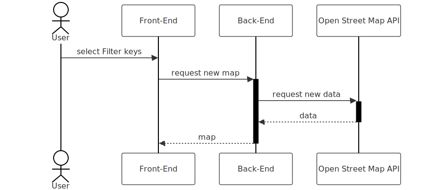
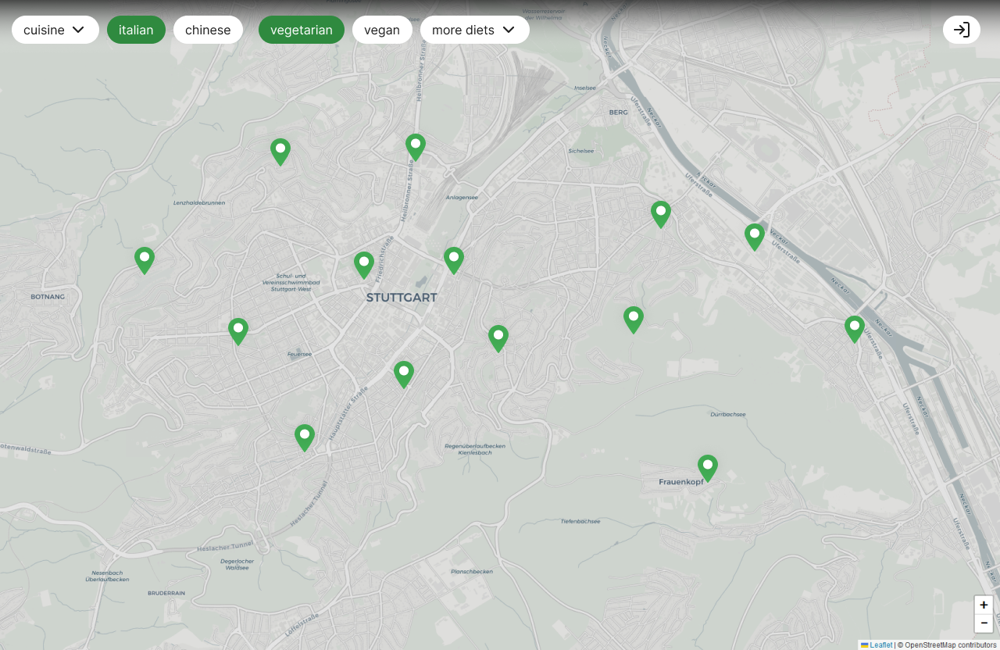
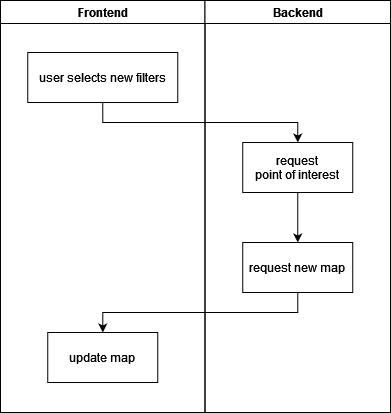
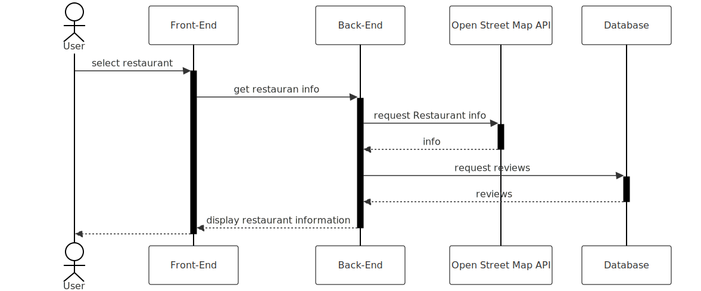
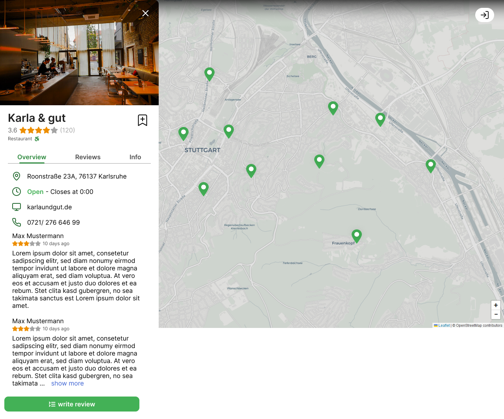
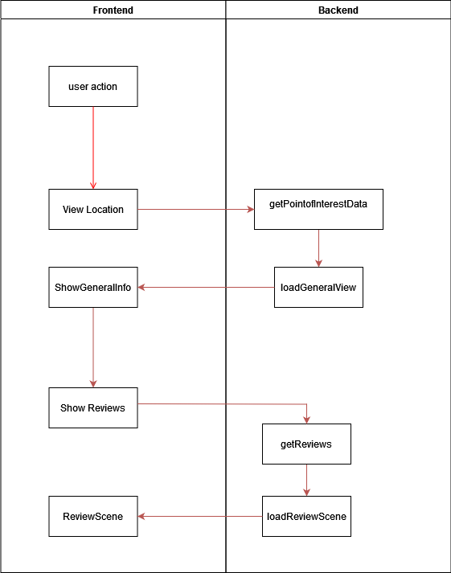
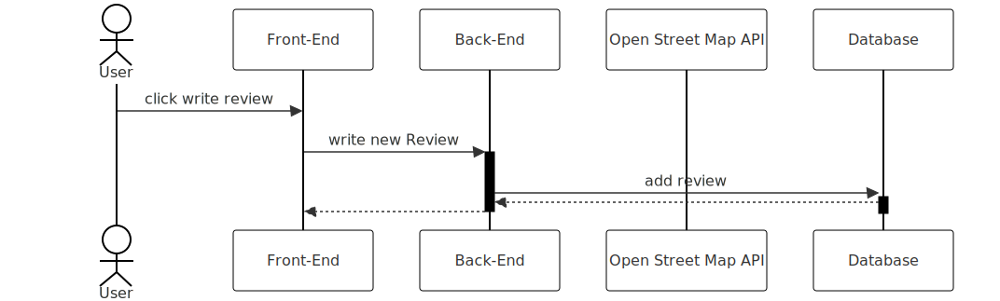
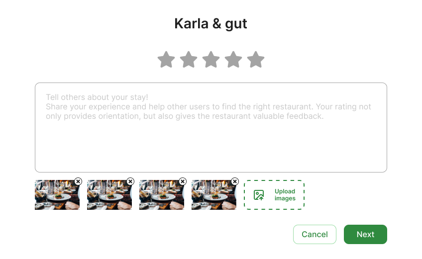
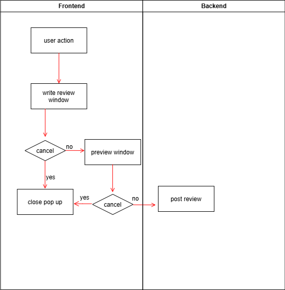

# SRS (**S**oftware **R**equirement **S**pecification)

## 1 Introduction
### 1.1 Purpose
This Software Requirement Specification (SRS) provides a comprehensive collection of 
all specifications of the "Green Sprout" restaurant-finder application. It outlines the 
purpose, scope, and key details of the project. The SRS describes both functional and non functional requirements necessary for the development and delivery of the application.

### 1.2 Scope
This project will be a web-based application. 
The main actors of this application can include restaurant owners, reviewers, or general 
visitors. 
The key features planned are:

- **Visual Map:** This map is the primary element of the user interface, displaying the 
area (e.g., Karlsruhe) and a set of location markers representing the restaurants at 
their respective locations.

- **Restaurant Profiles:** Each restaurant has a detailed profile that initially includes its 
name, type of cuisine, photos, overall rating, and existing reviews. 

- **Registering as a Reviewer:** Users can create an account with their first name, last 
name, email address and a password of choice. This is necessary to gain the ability 
to publish reviews of restaurants and create lists. 

- **Creating a Restaurants List:** Users can create lists with a title and a collection of 
restaurants of their choice.

- **User (Reviewer) Profiles:** Registered users have personal profiles featuring their 
name, profile picture, and a history of all the reviews they’ve written on the 
platform as well as their published restaurant lists.

- **Adding a new Review:** Each restaurant on the map will have an "Add a Review" 
option, allowing users to write a review, upload photos, and provide a star rating.

- **Filtering Restaurant Searches:** Users will be able to filter restaurants based on 
cuisine type and diet.

### 1.3 Definitions, Acronyms and Abbreviations
| Abbreviation | Explanation |
| --- | --- |
| SRS | Software Requirement Specification |
| MVP | Minimum Viable Product |
| n/a | not applicable |

### 1.4 References
| Title | Date | Publishing Organization |
| --- | --- | --- |
| [Green Sprout Blog](https://github.com/green-sprout/blog/discussions) |  | Green Sprout Team |
| [Green Sprout GitHub Organization](https://github.com/green-sprout) |  | Green Sprout Team |

### 1.5 Overview
This Software Requirements Specification (SRS) document for the "Green Sprout" project 
outlines all the requirements necessary for the development of the restaurant-finder application. 
It serves as a comprehensive guideline for the design, development, and implementation of the 
application.

The SRS document is structured to cover both functional and non-functional requirements in 
detail. The document is divided into several sections:

**Section 1** introduces the project, covering its purpose, scope, and relevant definitions. It also includes references to related documents and resources.

**Section 2** provides an overall description of the product, explaining its context, user 
characteristics, product features, assumptions, and constraints.

**Section 3** presents the specific requirements, both functional (such as map filtering, restaurant profiles, user registration, and reviews) and non-functional (usability, reliability, and performance). This section details each feature with pre-conditions and post-conditions where 
applicable, ensuring clear expectations for both developers and testers.

**Section 4** includes supporting information and especially contact information about the team.

## 2. Overall Description
### a. Product perspective
*Green Sprout* is a restaurant-finder web-based application. The product is intended to serve 
as a comprehensive platform for finding, reviewing, and recommending restaurants within 
a specific geographic area, such as Karlsruhe. The platform allows users to register as 
reviewers, browse restaurants, and filter search results by cuisine type and diet preferences. 
They can also create lists with selected restaurants of their choice. The application aims to 
provide users with a rich visual interface and interactive map, helping users make informed 
dining decisions based on location, ratings, and reviews.

### b. Class Diagram

### c. Use Case Diagram

### d. Tech-Stack
| Scope | Technology |
| --- | --- |
| Frontend | JavaScript Framework (Vue.js) |
| Backend | Java Framework (Springboot) |
| Database | PostgreSQL |
| Project Management | Jira |
| IDE | IntelliJ, VSCode |
| Deployment | GitHub Actions |
| Testing | diverse |

### e. User characteristics
**Reviewers:** Registered users who can write reviews, upload images, ratings to restaurants 
and create restaurant lists. They are primarily food enthusiasts who want to share their 
experiences.
**General Users:** Unregistered users or casual viewers who want to browse restaurants, view 
reviews, and explore the map without creating an account.

### f. Requirement subsets:
**Core Requirements:** Features necessary for the minimum viable product (MVP) include the map, restaurant and user profiles, user registration, review submission, and filtering.  
**Additional Features:** Future expansions could include the ability to create restaurant lists 
and add the ability to filter also for non-restaurant businesses (e.g., bars, shops).

## 3. Specific Requirements
### 3.1 Functionality
This section will explain the different use cases as seen in the Use Case diagram and their 
functionality  
**1. Configure map filter**  
This functionality gives the user the possibility to filter for specific keys like cuisines 
and diets.
Sequence Diagram:

GUI Mockup:

Activity Diagram:  
  
**pre-conditions:** The user opened the website and is in the initial map view and selected filters.
**post-conditions:** The map displays only the restaurants that match the selected filters.  
**Story points:** 13

**2. View point of interest**  
View point of interest shows the user information about the selected point of interest (e.g restaurant) including name, cuisine, pictures, overall rating and existing reviews.
Sequence Diagram:

GUI Mockup:

Activity Diagram:  
  
**pre-conditions:** Clicked on restaurant marker on the map.  
**post-conditions:** Side bar with restaurant information and reviews opens.  
**Story points:** 13

**3. Write review**  
A reviewer has the possibility to write a review for the currently selected restaurant. The review includes a rating and optionally pictures as well a review text.  
Sequence Diagram:

GUI Mockup:

Activity Diagram:  
  
**pre-conditions:** The user is logged in and on the restaurant's profile page and clicked on "write review” button.  
**post-conditions:** Pop-up window to write review opens.  
**Story points:** 21

**4. Create lists (soon)**  
With this functionality reviewers get the chance to save restaurants in a list. To remember their favorite restaurants or keep track of restaurants they want to visit.
Sequence Diagram:  
*coming soon*  
GUI Mockup:  
*coming soon*  
**pre-conditions:** The user is logged in and has access to the restaurant profiles.  
**post-conditions:** The user can create a new list and add restaurants to it, with the option to name the list.  
**Story points:** -

**5. Share list (soon)**  
This functionality provides reviewers the option of sharing their list with other users.  
Sequence Diagram:  
*coming soon*  
GUI Mockup:  
*coming soon*  
**pre-conditions:** The user has created at least one list and is logged in.  
**post-conditions:** The user can share the list with other users via a link or other sharing options.  
**Story points:** -

**6. Customize list (soon)**  
Reviewers also need the possibility to remove restaurants from their list, change the name of the list or delete it if it's not used anymore.  
Sequence Diagram:  
*coming soon*  
GUI Mockup:  
*coming soon*  
**pre-conditions:** The user has an existing list and is logged in.  
**post-conditions:** The user can update the list by removing restaurants, changing the list name, or deleting the list entirely.  
**Story points:** -

### 3.2 Usability
#### 3.2.1 User Training and Learning Time
**Normal Users (General Visitors and Unregistered Users):** The application should be intuitive enough that a new user can browse restaurants, view details, and read reviews with minimal effort. No training should be required, and users should become proficient in basic tasks (e.g., navigating the map, searching restaurants) within a few minutes.  
**Power Users (Registered Reviewers):** Reviewers who will frequently submit reviews, upload photos, and manage restaurant lists should become proficient in these more complex tasks after doing them once.

#### 3.2.2 Task Efficiency
**Restaurant Search and Filtering:** Users should be able to filter restaurant searches by 
cuisine type or diet within 5 clicks or taps. The results should update in under 3 seconds
on average.  
**Review Submission:** Registered users must be able to submit a new review with a star 
rating and upload photos in under 3 minutes, assuming an average internet connection.

#### 3.2.3 User Interface (UI) Standards
The UI should adhere to modern usability standards for web applications, such as providing a consistent layout across all pages, and easy-to-read fonts.  
Interactive elements (buttons, forms, filters) should be clearly distinguishable with appropriate spacing and color contrast.

#### 3.2.4 Error Handling and Feedback
Users must receive clear and concise feedback when an error occurs (e.g., invalid form 
inputs, failed review submission).  
The system should provide confirmations for critical actions such as submitting reviews 
or creating new restaurant lists.

### 3.3 Usability
#### 3.3.1 Availability
The system must be available 97% of the time.  
Scheduled maintenance windows should be communicated to users in advance.
#### 3.3.2 Fault Tolerance
The system must be capable of handling unexpected failures in the database, server, or network without causing a complete system shutdown.
#### 3.3.3 Data Integrity
The system must ensure that user reviews, restaurant profiles, and other critical data are stored safely, even in the event of hardware failure, power outages, or software crashes.  
Transaction management and database operations must follow ACID (Atomicity, Consistency, Isolation, Durability) principles to guarantee data integrity.

### 3.4 Performance
#### 3.4.1 Response Time
The system must provide a response time of less than 3 seconds for all major user actions under normal conditions, including:
- Searching for restaurants
- Viewing restaurant profiles
- Submitting reviews and ratings
In high load conditions, the response time should not exceed 5 seconds.  
Actions involving media uploads (e.g., images of restaurants) should complete within 5 seconds for files under 5MB. For larger files, the system should notify users about expected upload time and provide feedback on progress.

#### 3.4.2 Database Performance
Queries to the database (e.g., fetching restaurant details, reviews, or user profiles) must return results within 2 seconds under normal load and no more than 5 seconds under peak load.  
Bulk operations, such as batch importing of restaurant data, should complete within 15 minutes.

### 3.5 Supportability
#### 3.5.1 Coding Standards
The Green Sprout project will adhere to clean code principles and industry best practices, ensuring modular, maintainable, and scalable code.  
All code will follow standard naming conventions, proper indentation, and include sufficient comments to enhance readability and ease future development.  
Version control (Git) will be used to manage code changes, ensuring traceability and allowing for safe rollbacks when necessary.

#### 3.5.2 Testing Strategy
A comprehensive testing strategy will be implemented, including automated unit tests.  
All features will undergo testing across different desktop devices and browsers to guarantee compatibility and performance.

### 3.6 Design Constraints
**Technology Stack:** The application will be built using Vue.js for the frontend, Spring Boot with Java for the backend, and PostgreSQL as the database. These technologies define the framework and limit the design to what is supported by these tools.  

**Responsiveness:** The user interface must be designed to work seamlessly across various desktop devices, adhering to responsive design principles.  

**Data Storage:** The application will store user and restaurant data in a relational database (PostgreSQL), which constrains the design to a schema that ensures efficient querying and data integrity.  

**Security:** All design elements must consider security measures like encrypted  communication (HTTPS), authentication, and secure database access to protect user data and maintain privacy.

### 3.7 On-line User Documentation and Help System Requirements

The usage of the web application should be as intuitive as possible so it won't need any further documentation. If the user needs some help they should be able to contact the development team.

#### 3.8 Purchased Components
We don't have any purchased components yet. If there will be purchased components in the future we will list them here.

### 3.9 Interfaces
The user interfaces to be implemented are:

- Home Page – Displays a map with restaurant markers, search options, and featured restaurants.
- Restaurant Profile Page – Shows detailed information about a restaurant, including images, reviews, ratings, and location.
- User Profile Page – Displays user information, reviews they’ve written, favorite restaurants, and preferences.
- Login Page – Allows users to log into the platform.
- Register Page – Provides a registration form for new users to sign up.
- Review Submission Page – Allows users to submit reviews and ratings for restaurants, including uploading images.
- Create a List Page – Allows users to create a new list from a collection of chosen restaurants.
- View a List Page - Allows users to view own/ shared lists and its contents

#### 3.9.1 Hardware Interfaces
n/a

#### 3.9.2 Software Interfaces
This application will be runnable on desktop browsers (Chrome, Edge, Safari, Firefox, etc.).

#### 3.9.3 Communications Interfaces
The server and browser will communicate using https protocol.

### 3.10 Architecturally Significant Requirements

|Quality attribute|Refinement|Quality attribute scenarios|Business value|Technical risk|
|---|---|---|---|---|
|Aesthetics|Design|The design is centered around meeting user needs with a cohesive, green-themed design system. Visual elements are consistently styled to ensure a unified look and feel across the interface. Interactive elements, such as buttons, provide immediate feedback for example color change, giving users a clear confirmation of their actions and enhancing the overall user experience.|H|L|
|Conformance|Ease of Deployment|Deploying a new version of a component should be made simple by providing sufficient resources to the deployer. The new component must be backward compatible to ensure stable conversion to newer program versions.|M|L|
|Performance|Response Time|The application, especially in terms of communication with the backend and API, should maintain a response time under 2 seconds. Ideally, it should stay within the 1-second range to ensure a seamless user experience.|H|M|
||Page Speed|A user, no matter what device, should see a visually appealing and fast page. A google page speed insight analysis of at least 90 points is considered to be good|H|L|
|Serviceability|Modularity|Backend, Frontend & Database should be seperated at any given time. Sections should be kept structured to allow adding further Feature-Modules at a later point.|M|M|
|Security|User-Data-Encryption|By hashing the password of a user immediately after recieving it in the backend, and only storing this hash guarantees the security of the password. The authentication of all user requests and their integrity is verified by using industry-standard JWT tokens.|H|H|

### 3.11 Licensing Requirements
n/a

### 3.12 Legal, Copyright, and Other Notices
We do not take responsibility for any incorrect data or errors in the application.

### 3.13 Applicable Standards
The development will follow the common clean code standards and naming conventions (see section [3.5.1 Coding standards](#351-coding-standards)).

## 4. Supporting Information
For any further information you can contact the Green Sprout Team or check our [Green Sprout Blog](https://github.com/green-sprout/blog/discussions)  
The Team Members are:  
- Paula Kropfinger  
- Valentin Wöhrle  
- Jonas Schlösser  
- Samuel Brekeller  
- Safae Kartite
